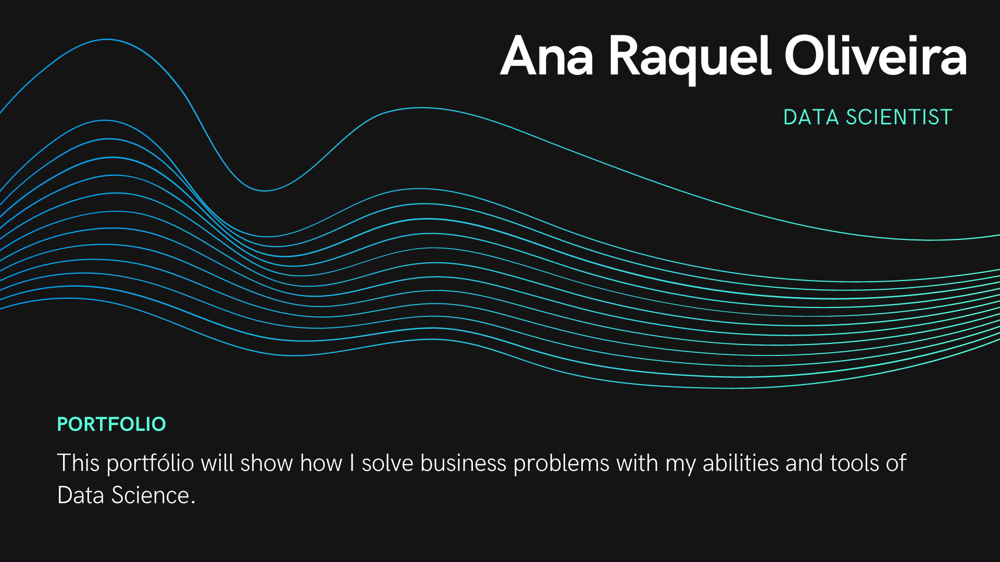
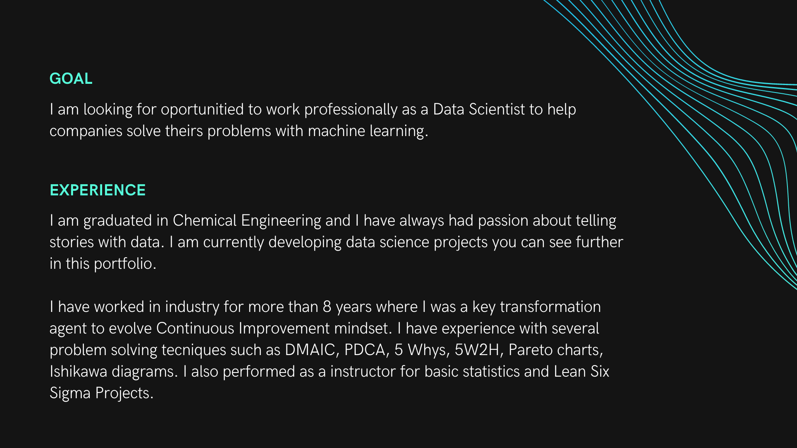
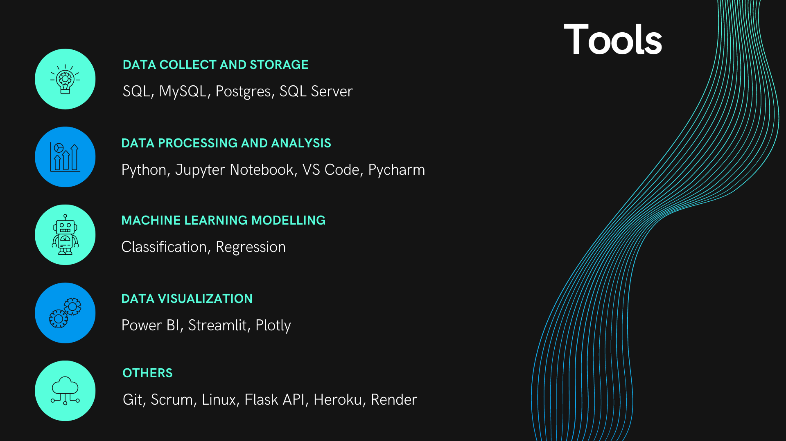

# Projects
## 📒 [Ranking clients in a health insurance company]()

Create list of clients more likely to buy a second product based in their caracteristics. It was use a logistic regression algotithm for clients classification based in its propability to buy. The project will help to reduce costs in commercial area due to reduced number of phone calls.

## 📈  [Sales prediction for Rossmann using Regression](https://github.com/anaraquelou/ds-em-producao)

Predict sales six weeks in advance to calculate the amount of money loan to expand part of business. A regression model called XGBoost was used and the final of first CRISP cycle a **10% error MAPE** was achieved, resulting in a estimaed saving of **$ 5MM**.

## 🏘 [Insights for house sales using EDA](https://github.com/anaraquelou/house-rocket-project)

Recommendation of best properties to buy in Seattle region. Through a Exploratory Data Analysis using maps created in Streamlit and descriptive statistics it was possible to extract valuabled insights for a company that buy and sell houses in a short period of time.
